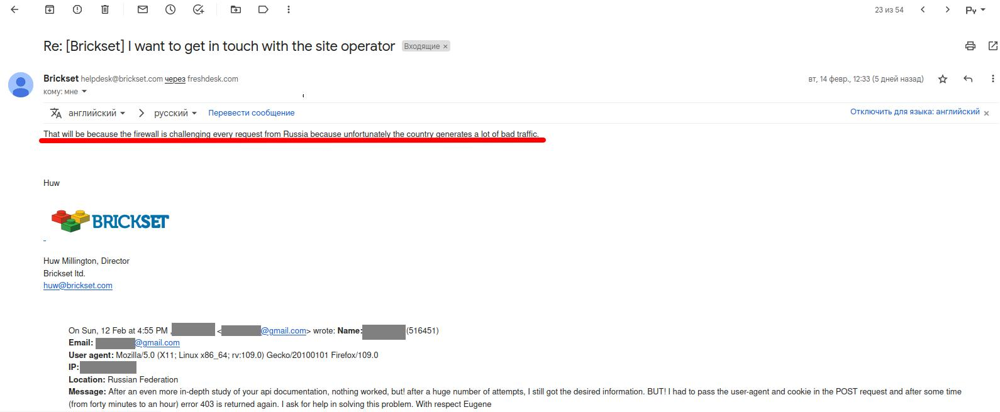
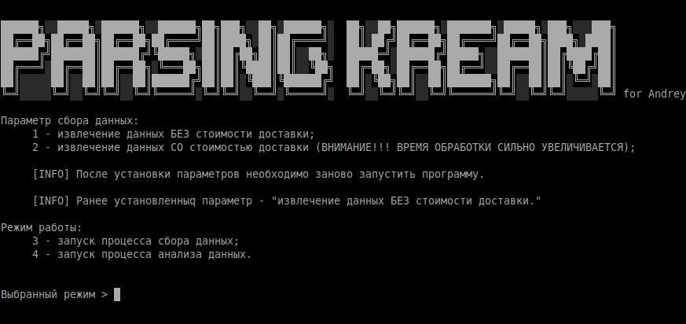

# ПАРСЕР товаров корейской торговой площадки www.cream.co.kr

    

## Описание:
Парсер товаров корейской торговой площадки www.cream.co.kr (далее - ПАРСЕР), собирает информацию по введенным в конфигурционном файле (config.ini) критериям поиска в отдельный XLSX файл (при каждом новом запуске будет создаваться не новый файл, а новый лист документа). Возможен сбор информации сразу-же с ценой доставки в Российскую Федерацию, но данный процесс очень сильно увеличивает время работы парсера и не всегда работает корректно, так ка по ответу службы поддержки сайта https://brickset.com/ из РФ идет очень много ПЛОХОГО трафика и они блокируют работу API сервиса и приходится использовать магию PROXY. Далее собранную информацию возможно проанализировать запустив процесс аналитики, при данном действии будет создан новый файл куда будут сохраниться позиции товаров которые изменились (сравниваются ПОСЛЕДНИЙ и ПРЕДПОСЛЕДНИЙ лист в файле). 



### Запуск:
 Установка необходимых зависимостей в Linux

 ```shell
pip3 install -r /ПУТЬ/ДО/СКРИПТА/req.txt 
``` 

 Установка необходимых зависимостей в Windows

 ```shell
pip install -r /ПУТЬ/ДО/СКРИПТА/req.txt 
``` 

 1. При первоначальном запуске программы парсинга товаров корейской торговой площадки www.cream.co.kr (далее - ПАРСЕР), будет предложено произвести первоначальную настройку парсера посредством записи в файл конфигурации (config.ini) необходимых регистрационных данных. Данное действие необходимо производить только при первом включинии или при удалении файла конфигурации.
 2. Следующие включения будут происходить в штатном режиме, миную настройку.
 
3. Режимы выбираются посредством ввода цифрового значения в поле "Выбранный режим >" и подтверждения ввода клавишей "Enter".


